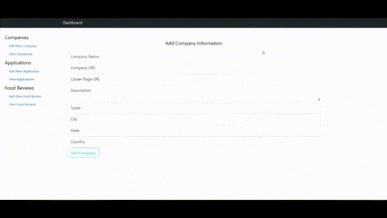
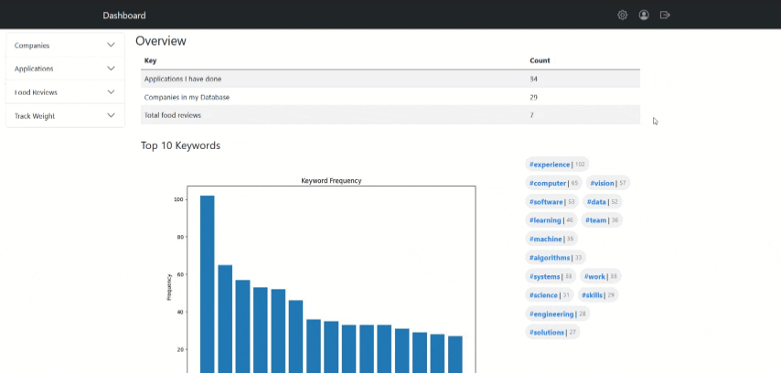
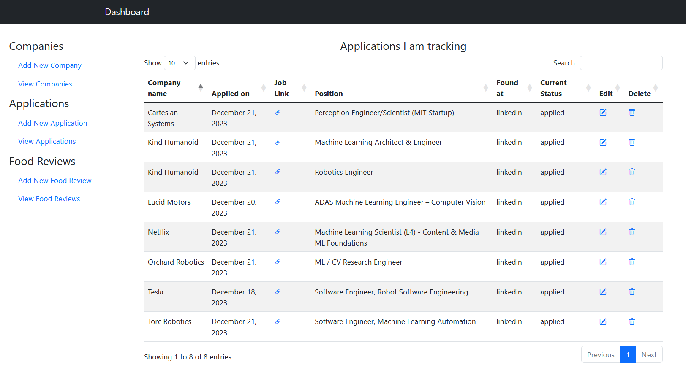

# Personal Life Tracker - A Web App for Self-Awareness

This personal life tracker web app allows you to gain insights into your daily life by tracking your expenditures, food consumption, leisure activities, and more. Built with Flask (can change) and Bootstrap for a user-friendly experience, the app is self-hosted and leverages MongoDB and AWS for data storage.

<!--  -->

<!-- 
 
-->

## Installation

### Prerequisites

- Python 3.6 or higher
- MongoDB Account
- AWS account (optional for image storage)

### Setup

1. Clone the repository
2. Install the required packages using `pip install -r requirements.txt`
3. Rename `credentials_template.json` file as `credentials.json` in the root directory and add the appropriate credentials
4. Run the app using `python app.py`
5. Navigate to `localhost:5000` in your browser
6. Enjoy!

## Features:

###  Track your spending:
- [ ] Record expenses, including category, amount, date, and location.
- [ ] Insights into spending habits and identify areas for improvement using pie and bar charts which provide a visual representation of your expenditures.
- [ ] Monthly and yearly summaries allow comparison of spending over time.
- [ ] Export data to a different file formats for further analysis.

##### From MyExpenses.mobi website:
- [ ] Group your transactions per day, week, month and year
- [ ] Sum up all your accounts (Sophisticated handling of exchange rates per account and per transaction)
- [ ] Define how much you intend to spend in yearly, monthly or weekly budgets
- [ ] Split one transaction to multiple categories
- [ ] Visualize the distribution per category
- [ ] Understand how your financial situation evolves over time
- [ ] Print to PDF and exchange via QIF and CSV

### Log your food intake:
- [ ] Record meals and snacks, including name, price, date, location, and an image.
- [ ] Track calorie intake and analyze dietary patterns (get information of that specific item from the internet).
- [ ] Rate experience with each food item / Location that you tried that for future reference (stars or score out of 10).

### Application tracker:
- [x] Track companies one has applied to, position applied for, application date, and status.
- [ ] Contact information for each company, including website, email(optional), and contact LinkedIn.

### Company tracker:
- [ ] Track companies you're interested in
  - [x] Their contact information
  - [ ] Past interactions (if iterviewed what did they ask and other stuff)
- [ ] (Optional) Allow promotional content from companies that you're interested in to be displayed on the app (if we plan to make it public and get some money from it).

### Technology Stack:

- Frontend: Not decided yet
- Backend: Not decided yet
- Database: Not decided yet

### Hosting:

    Self-hosted for greater control and privacy.

### Interested in contributing?:

    Please read the CONTRIBUTING.md file for more information.

Let's take control of your life and make informed decisions with the Personal Life Tracker!